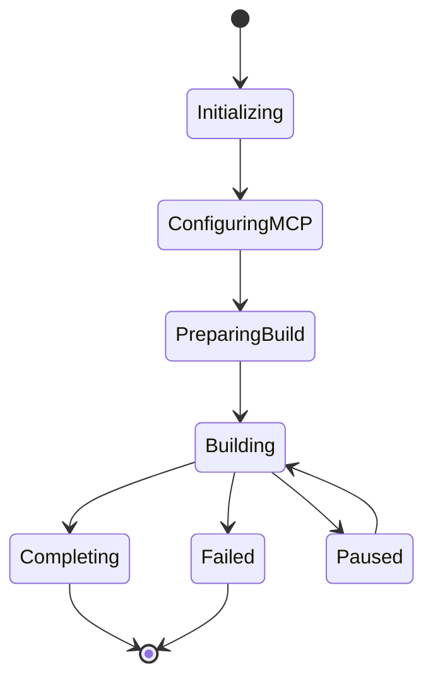
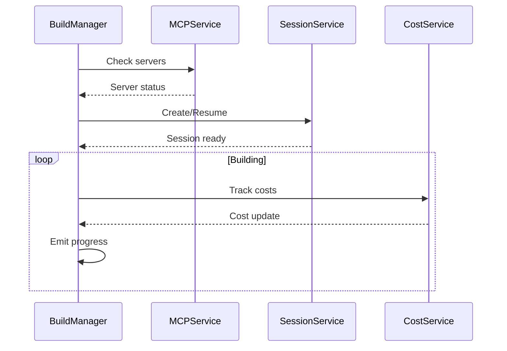

# Build Manager Architecture

## System Components

### BuildManager
The core class that orchestrates the entire build process. It:
- Manages the lifecycle of builds
- Coordinates between different services
- Handles event emission
- Manages state transitions

### Services

#### MCPService
Handles all MCP server interactions:
```typescript
interface MCPService {
  checkServer(name: string): Promise<ServerStatus>;
  installServer(name: string): Promise<void>;
  configureServer(name: string, config: ServerConfig): Promise<void>;
  monitorHealth(): void;
}
```

#### SessionService
Manages Claude sessions:
```typescript
interface SessionService {
  create(): Promise<Session>;
  resume(sessionId: string): Promise<Session>;
  save(session: Session): Promise<void>;
  cleanup(maxAge?: number): Promise<void>;
}
```

#### CostService
Tracks and manages build costs:
```typescript
interface CostService {
  trackCost(amount: number): void;
  getCurrentCost(): number;
  checkLimit(limit: number): boolean;
  getProjection(progress: number): number;
}
```

#### MetricsService
Collects and reports build metrics:
```typescript
interface MetricsService {
  recordDuration(phase: string, duration: number): void;
  recordMemory(usage: number): void;
  recordApiCalls(count: number): void;
  generateReport(): BuildMetrics;
}
```

### Utils

#### ProgressTracker
Handles build progress tracking:
```typescript
interface ProgressTracker {
  updateProgress(phase: string, progress: number): void;
  getCurrentPhase(): string;
  getOverallProgress(): number;
  estimateTimeRemaining(): number;
}
```

#### ErrorHandler
Centralizes error handling:
```typescript
interface ErrorHandler {
  handleError(error: Error): void;
  recover(state: BuildState): Promise<void>;
  logError(error: Error): void;
}
```

## State Management

### BuildState
```typescript
interface BuildState {
  status: BuildStatus;
  currentPhase: string;
  progress: number;
  costs: CostMetrics;
  errors: ErrorLog[];
  sessionId?: string;
  mcpServers: ServerStatus[];
}
```

### State Transitions


## Event System

### Core Events
```typescript
type BuildEvent =
  | { type: "buildStart"; options: BuildOptions }
  | { type: "buildProgress"; phase: string; progress: number }
  | { type: "buildComplete"; result: BuildResult }
  | { type: "buildError"; error: Error }
  | { type: "costUpdate"; cost: number }
  | { type: "mcpStatus"; status: ServerStatus[] };
```

### Event Flow


## Configuration

### Build Configuration
```typescript
interface BuildConfig {
  maxCost?: number;
  timeout?: number;
  mcpServers: MCPServerConfig[];
  retryStrategy: RetryConfig;
  logging: LogConfig;
  metrics: MetricsConfig;
}
```

### Environment Variables
```bash
CLAUDE_BUILD_MAX_COST=10
CLAUDE_BUILD_TIMEOUT=3600
CLAUDE_BUILD_LOG_LEVEL=info
CLAUDE_BUILD_METRICS_ENABLED=true
```

## Security

### Authentication
- API key management
- MCP server credentials
- Session token handling

### Resource Protection
- Cost limits
- Timeout enforcement
- Resource quotas
- Rate limiting

### Data Safety
- Session data encryption
- Secure configuration storage
- Audit logging

## Error Handling

### Error Types
```typescript
type BuildError =
  | MCPServerError
  | SessionError
  | CostLimitError
  | TimeoutError
  | ResourceError;
```

### Recovery Strategies
- Automatic retry with backoff
- Session state preservation
- Graceful degradation
- Resource cleanup

## Performance Considerations

### Optimization Points
- Session reuse
- MCP server connection pooling
- Batch operations
- Caching strategies
- Memory management

### Monitoring Points
- API latency
- Memory usage
- CPU utilization
- Cost efficiency
- Build duration

## Integration Points

### External Systems
- Claude SDK
- MCP Servers
- Logging systems
- Metrics collectors
- CI/CD systems

### APIs
- REST endpoints
- WebSocket events
- CLI interface
- SDK exports 